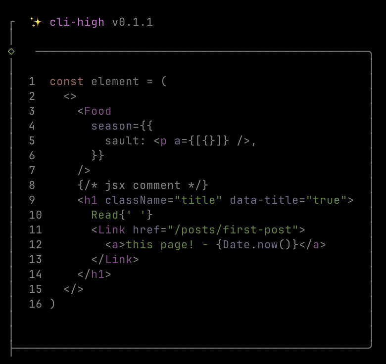

# cli-high

✨ Tiny syntax highlighting for your terminal

[](https://www.npmjs.com/package/cli-high)

## Preview



## CLI Usage

```bash
npx cli-high ./path/to/your/js/file
```

## Programmatic Usage

```ts
import { highlight } from 'cli-high'

const highlighted = highlight('console.log("Hello, World!")')
```

## License

[MIT](./LICENSE) License © 2024 [xinyao27](https://github.com/xinyao27)
